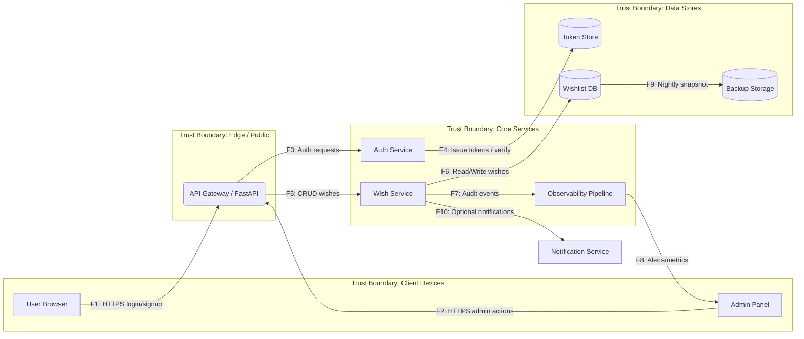

# Security Requirements & Threat Model

## Соответствие чек-листу
- Документация угроз: DFD, STRIDE, регистр рисков и NFR лежат в `docs/threat-model` и `docs/security-nfr`.
- NFR ≥ 9 с критериями приёмки; есть трассировка на user stories / компоненты.
- DFD содержит 4 доверительные зоны (Client, Edge, Core, Data) и 10 потоков F1–F10
- STRIDE покрывает ≥ 8 угроз, связанные с NFR; риски приоритизированы (L/I, стратегия, сроки, критерии закрытия).
- Дополнительно: ADR-001/002/003 фиксируют решения, связанные с NFR-02/03/05.

## NFR (`docs/security-nfr/NFR.md`)
| NFR ID | Требование | Критерий | Проверка | Компонент | Приоритет |
| --- | --- | --- | --- | --- | --- |
| NFR-01 | Хэширование паролей | PBKDF2-HMAC-SHA256, 130k итераций, соль 16B | Юнит-тест `test_security_hash_params`, код-ревью | Auth сервис | High |
| NFR-02 | TTL access-токена | TTL access token ≤ 15 минут, refresh отключён | Pytest сценарии + конфиг FastAPI | Auth сервис | Medium |
| NFR-03 | Brute-force защита логина | Не более 5 fail/min на пользователя, 429 далее | E2E тест + future rate-limit middleware | API шлюз | High |
| NFR-04 | Owner-only доступ | 100% CRUD эндпойнтов возвращают 404/403 при чужом ID | Контрактные тесты `tests/test_wishes.py` | Wish сервис | High |
| NFR-05 | Формат ошибок | Все ошибки в JSON-обёртке с `error.code` и `request_id` | Pytest snapshot + middleware логирования | API слой | Medium |
| NFR-06 | Латентность `/api/v1/wishes` | p95 ≤ 400 мс @ 30 RPS, p99 ≤ 800 мс | k6 нагрузочный тест на stage | Wish сервис | Medium |
| NFR-07 | Уязвимости зависимостей | High/Critical в SBOM закрываются ≤ 7 дней | CI: `pip-audit`/`gh advisories` | Build pipeline | High |
| NFR-08 | Логи аудита | ≥ 1 запись на запрос, хранение 90 дней | Observability stack + pytest мок | Logging слой | Medium |
| NFR-09 | Бэкапы wish data | Ежедневные snapshot’ы, восстановление еженедельно | Backup job + runbook | БД | Medium |

### Трассировка NFR (`docs/security-nfr/NFR_TRACEABILITY.md`)
| NFR ID | Story / Task | Компонент | Приоритет | Release Window | Примечание |
| --- | --- | --- | --- | --- | --- |
| NFR-01 | AUTH-10: Реализовать PBKDF2 хэширование | Auth | High | P04 | покрыто текущим кодом `shared/security.py` |
| NFR-02 | AUTH-15: Управление TTL access-токенов | Auth | Medium | P05 | потребует конфигурации redis/session store |
| NFR-03 | API-21: Rate-limit логина | API gateway | High | P06 | интеграция с FastAPI middleware + Redis |
| NFR-04 | WISH-08: Owner-only CRUD | Wish service | High | P02 | покрыто тестами `tests/test_wishes.py` |
| NFR-05 | OBS-03: Единый формат ошибок и request_id | API layer | Medium | P07 | нужен middleware логирования |
| NFR-06 | PERF-04: Нагрузочный тест wishlist | Wish service | Medium | P08 | сценарии k6 в infra repo |
| NFR-07 | SEC-12: Мониторинг зависимостей (SCA) | CI/CD | High | P05 | добавить шаг pip-audit в workflow |
| NFR-08 | OBS-05: Audit log операций | Logging | Medium | P09 | связка с ELK/OTEL, храним ≥90 дней |
| NFR-09 | DB-02: Бэкап Postgres | Database | Medium | P10 | автоматизированный snapshot в S3 |

## DFD (`docs/threat-model/DFD.md`)

## Модель угроз
- Активы: учетные записи и токены (Auth/TOK), данные желаний (DB/BAK), логи аудита (LOG), админ-функции.
- Границы доверия: Client (недоверенная), Edge (публичный API), Core (сервисы), Data (хранилища/бэкапы). Все пересечения требуют TLS; Core↔Data с ограничением сетевых политик.
- Основные угрозы STRIDE: S/T на логине (F1), E в админке (F2), T/R на канале GW↔Auth и токен-хранилище (F3–F4), T/I на CRUD wishes (F5), D на БД (F6), I/R на логи и оповещения (F7–F8), I/T на бэкапы (F9), S на webhook уведомлениях (F10).
- Меры: rate-limit, единый error envelope, RBAC/раздельные токены, mTLS/VPC, audit log, owner-check, перф-пороги и индексы, redaction логов + ACL, SCA/alerts, шифрование и restore-тест бэкапов, HMAC-подпись вебхуков. Каждая мера трассируется к NFR-02/03/04/05/06/07/08/09.

## STRIDE угрозы (`docs/threat-model/STRIDE.md`)
- F1 `/auth/login`: S — брутфорс токенов; мера — rate-limit 5 fail/min, связка с NFR-03.
- F1 `/auth/login`: I — подробные ошибки логина; мера — единый error envelope, NFR-05.
- F2 Admin panel: E — повышение привилегий; мера — роли/отдельные токены, NFR-04.
- F3 GW→Auth: T — подмена запросов; мера — mTLS/VPC + подпись токенов, NFR-02.
- F4 Token Store: R — нет аудита выдачи токенов; мера — audit log, NFR-08.
- F5 CRUD wishes: T/I — IDOR; мера — owner-check + 404 masking, NFR-04.
- F6 DB Ops: D — блокировки/медленные запросы; мера — p95/p99 пороги + индексы + k6, NFR-06.
- F7 Audit log: I — PII в логах; мера — редактирование/ACL, NFR-08.
- F8 Alerts: R — нет оповещений SCA; мера — метрики/alerts, NFR-07.
- F9 Backups: I/T — утечка/невосстановимость бэкапов; мера — шифрование + restore-тест, NFR-09.
- F10 Notifications: S — подмена webhook; мера — HMAC-подпись и проверка секретов, NFR-08.

## ADR-001/002/003
| ADR | Решение | Импакт на безопасность | Альтернативы (+/−) | Rollout plan |
| --- | --- | --- | --- | --- |
| ADR-001 RFC 7807 errors | Единый error envelope + `request_id` middleware | Снижает раскрытие деталей (F1/F5), упрощает расследование (R2), выполняет NFR-05 | RFC 9457 без custom code (+ уже готовые либы, − меньше контроля); оставить кастомный формат (+ минимум изменений, − нарушает NFR) | Включить middleware и helper `problem_response`; прогнать тесты `test_errors.py`; прокатить конфиг в prod, убедиться в логировании `request_id` |
| ADR-002 Login rate limit | 5 fail/min in-memory limiter | Снижает риск брутфорса (R1), выполняет NFR-03 | Redis limiter (+ горизонталка, − сложнее инфраструктура); лимит на реверс-прокси (+ не грузит app, − сложнее тестировать) | Деплой лимитера, мониторинг 429, алерт на рост блокировок; план миграции на Redis к P09 |
| ADR-003 Token TTL | Храним `issued_at`, TTL 900s | Уменьшает окно атаки при утечке токена (R5), выполняет NFR-02 | JWT с `exp` (+ stateless, − ключи/ротация); refresh токены (+ UX, − сложнее протокол); бесконечные токены (+ просто, − нарушает NFR) | Обновить схему токен-хранилища, параметризовать `APP_TOKEN_TTL_SECONDS`, прогнать `test_token_expires_after_ttl`; при масштабировании вынести в Redis/session store |

## Риски (`docs/threat-model/RISKS.md`)
| RiskID | Описание | Связь (F/NFR) | L | I | Стратегия/критерий |
| --- | --- | --- | --- | --- | --- |
| R1 | Брутфорс логина → угон аккаунта | F1, NFR-03 | 4 | 4 | Снизить; rate-limit middleware в прод + e2e тесты |
| R2 | Утечка подробностей ошибок (PII) | F1, NFR-05 | 3 | 3 | Снизить; контрактные тесты на error envelope |
| R3 | Незаконное повышение прав через admin endpoint | F2, NFR-04 | 2 | 5 | Снизить; RBAC + отдельные токены, ревью |
| R4 | Подмена запросов между GW и Auth | F3, NFR-02 | 2 | 4 | Избежать; mTLS включён, сертификаты ротуются |
| R5 | Нет аудита выдачи/отзыва токенов | F4, NFR-08 | 3 | 3 | Снизить; audit log 100% операций |
| R6 | IDOR/чтение чужих wishes | F5, NFR-04 | 3 | 4 | Снизить; unit/e2e owner-only + code review |
| R7 | Degradation DB → DoS | F6, NFR-06 | 2 | 5 | Снизить; k6/perf тесты + индексы + alert на p95 |
| R8 | Логи содержат PII / утечка | F7, NFR-08 | 3 | 4 | Снизить; редактирование логов + ACL + тесты |
| R9 | Нет SCA контроля зависимостей | F8, NFR-07 | 4 | 3 | Снизить; pip-audit в CI, отчёты ≤ 7 дней |
| R10 | Бэкапы не восстановимы или утекли | F9, NFR-09 | 2 | 5 | Снизить; шифрованные snapshot + еженедельный restore |
| R11 | Подмена webhook уведомлений | F10, NFR-08 | 2 | 3 | Снизить; HMAC-подпись + проверка секретов |

## Вывод
- Чек-лист TM 0.15 закрыт: NFR ≥ 8 с критериями, STRIDE ≥ 8 угроз, DFD с доверительными границами, риски приоритизированы и трассированы к NFR/потокам.
