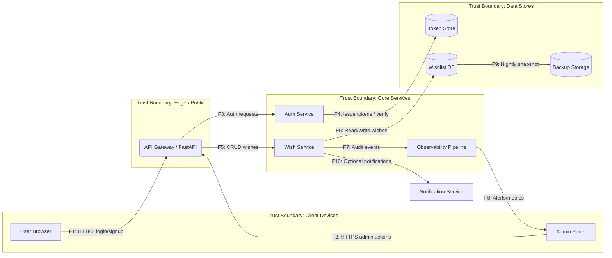

# Data Flow Diagram — Wishlist API



- Потоки F1–F10 используются в таблицах STRIDE и RISKS.
- Trust boundaries: `Client` (не доверяем устройствам), `Edge` (интернет-экспонированный слой), `Core` (приложение), `Data` (стойкое хранилище и бэкапы).
- Все меж-границы каналы выполняются по TLS внутри VPN/Priv network.
```
